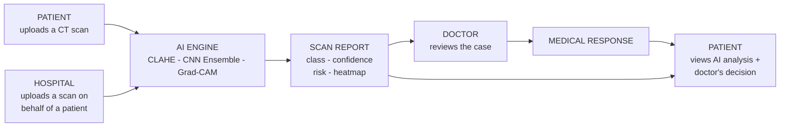

  

  

  
  
  
  
  
  
  

  
  
  
  

---

## Overview

**Sehtak AI** is a full-stack medical platform that brings artificial intelligence into the lung cancer screening workflow. It connects the three people involved in a diagnosis — the **Patient**, the **Doctor**, and the **Hospital** — around a single chest CT scan.

A scan enters the system, a deep-learning model classifies it across four lung categories, a **Grad-CAM** heatmap shows exactly which region drove the decision, and the case is routed to a licensed doctor for the final medical response.

> The model is built to **support** the physician, not replace them. The final diagnosis always belongs to a licensed doctor.

---

## How the System Works

Sehtak AI is organized around one object — a **scan** — that flows between three roles and the AI engine.

**Lifecycle of a scan**

1. A **patient** uploads a chest CT scan — or a **hospital** uploads it on the patient's behalf when the scan is held on their side.
2. The **AI engine** enhances the image, classifies it, and produces a report: predicted class, confidence, risk level, and a Grad-CAM heatmap.
3. The patient instantly sees the AI analysis and can **request a doctor review**.
4. A **doctor** opens the case — scan, AI summary, and patient medical history — and writes a medical response.
5. The **patient** receives the doctor's decision alongside the AI analysis, and can **book an appointment**.
6. The **hospital** tracks every report's status and assigns doctors to pending scans.

---

## The Patient

A patient signs in, completes a short medical history, uploads a scan, receives an explainable AI analysis, requests a doctor's opinion, and manages appointments.

<table>
  <tr>
    <td align="center"> 1. App Launch</td>
    <td align="center"> 2. Role-Based Login</td>
    <td align="center"> 3. Medical History Setup</td>
  </tr>
  <tr>
    <td align="center"> 4. Patient Dashboard</td>
    <td align="center"> 5. Upload Scan</td>
    <td align="center"> 6. AI Lung Analysis + Grad-CAM</td>
  </tr>
  <tr>
    <td align="center"> 7. Request Doctor Review</td>
    <td align="center"> 8. Doctor's Response</td>
    <td align="center"> 9. Appointments</td>
  </tr>
</table>

The **AI Lung Analysis** screen is the heart of the patient experience — it returns the predicted class, a confidence score, a colour-coded risk level, a Grad-CAM overlay, and clinical recommendations, all under a clear "AI decision-support only" notice.

---

## The Doctor

The doctor signs in, sees prioritized pending cases, reviews each scan together with the AI summary and the patient's medical history, then submits a professional medical response.

<table>
  <tr>
    <td align="center"> 1. Doctor Login</td>
    <td align="center"> 2. Doctor Dashboard</td>
    <td align="center"> 3. Pending Cases</td>
  </tr>
  <tr>
    <td align="center"> 4. Case Details + AI Summary</td>
    <td align="center"> 5. Write Medical Response</td>
    <td align="center"> 6. Verified Doctor Profile</td>
  </tr>
</table>

Each case shows the **Grad-CAM overlay**, the AI's predicted class and confidence, the patient's notes, and their medical, family, and allergy history — giving the doctor full context before deciding.

---

## The Hospital

The hospital signs in, uploads scans for patients whose imaging is held on their side, sends them to the AI, assigns doctors to pending scans, and tracks every report end-to-end.

<table>
  <tr>
    <td align="center"> 1. Hospital Login</td>
    <td align="center"> 2. Hospital Dashboard</td>
    <td align="center"> 3. Upload Scan for Patient</td>
  </tr>
  <tr>
    <td align="center"> 4. Reports Status + Assign Doctors</td>
    <td align="center"> 5. Bookings Management</td>
    <td align="center"></td>
  </tr>
</table>

---

## The AI Engine

The deep-learning module classifies a chest CT scan into four categories — **Adenocarcinoma, Large cell carcinoma, Squamous cell carcinoma, and Normal** — and explains every prediction.

| Stage | What happens |
| --- | --- |
| Image enhancement | CLAHE boosts local contrast on the CT slice |
| Augmentation | Rotations, flips and affine transforms expand the training set |
| Transfer learning | Four CNN backbones fine-tuned: ResNet-50, EfficientNet-B2, DenseNet-121, MobileNet-V3 |
| Two-phase training | Head trained with frozen backbone, then full fine-tuning (AdamW + CosineAnnealingLR) |
| Explainability | Grad-CAM heatmaps trace each prediction to the influential lung region |
| Robust inference | Model ensembling, test-time augmentation, and a confidence threshold for uncertain cases |

---

## Tech Stack

| Layer | Technologies |
| --- | --- |
| Mobile / Web | Flutter |
| Backend API | Node.js, Express, MongoDB, JWT |
| AI Service | Python, PyTorch, Torchvision, OpenCV, Flask |
| Explainability | Grad-CAM |

---

## Disclaimer

Sehtak AI was developed for **academic and research purposes**. It is **not a medical device** and must not be used for real diagnosis or treatment decisions. All AI output is decision-support only; the final diagnosis is made by a licensed physician.

---

## Author

**Hager Bayoumi** — Data Scientist and AI / ML Engineer

  
  
  

  

